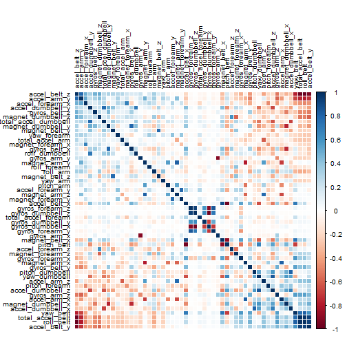
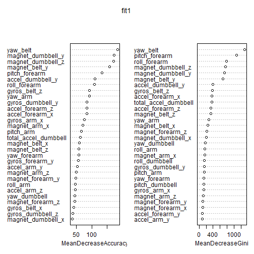
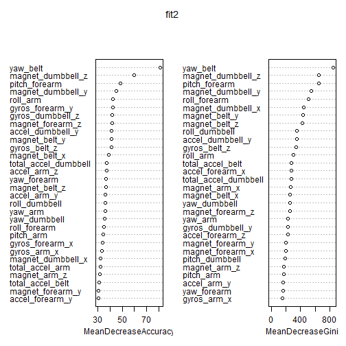

## 1.Background
Using devices such as *Jawbone Up*, *Nike FuelBand*, and *Fitbit* it is now possible to collect a large amount of data about personal activity relatively inexpensively. These type of devices are part of the quantified self movement – a group of enthusiasts who take measurements about themselves regularly to improve their health, to find patterns in their behavior, or because they are tech geeks. One thing that people regularly do is quantify how much of a particular activity they do, but they rarely quantify how well they do it. In this project, our goal will be to use data from accelerometers on the belt, forearm, arm, and dumbell of 6 participants. They were asked to perform barbell lifts correctly and incorrectly in 5 different ways.

The goal of this project is to predict the manner in which they did the exercise. This is the “classe” variable in the training set.

## 2.Data
In this section, we show how we downloaded and loaded the data, followed by some preprocessing.

```r
setwd("C:/Users/user/Dropbox/coursera/practical machine learning")

#download.file('https://d396qusza40orc.cloudfront.net/predmachlearn/pml-training.csv', destfile="training data.csv")

#download.file('https://d396qusza40orc.cloudfront.net/predmachlearn/pml-testing.csv', destfile="testing data.csv")

training<-read.csv("training data.csv", sep=",", 
                   na.strings=c("", "NA", "NULL", "#DIV/0!"))
```

```
## Warning in file(file, "rt"): cannot open file 'training data.csv': No such
## file or directory
```

```
## Error in file(file, "rt"): cannot open the connection
```

```r
testing<-read.csv("testing data.csv", sep=",", 
                   na.strings=c("", "NA", "NULL", "#DIV/0!"))
```

```
## Warning in file(file, "rt"): cannot open file 'testing data.csv': No such
## file or directory
```

```
## Error in file(file, "rt"): cannot open the connection
```

```r
#str(training)
#head(training)
dim(training)
```

```
## [1] 19622   160
```

##2.1 Preprocessing the data
From summarising the data (output suppressed not to make it explosive), we notice that many columns have many NAs in them, so they will probably not contribute much to the outcome. As a first step, we check how many features have more than 19000 missing values and drop them.

```r
#colSums(is.na(training))
training2<-training[, colSums(is.na(training))<19000]
dim(training2)
```

```
## [1] 19622    60
```
We also drop some columns that are likely to have little explanatory power because we believe are irrelevant.


```r
vector = c('X', 'user_name', 'raw_timestamp_part_1', 'raw_timestamp_part_2', 
           'cvtd_timestamp', 'new_window', 'num_window')
training3<-training2[, -which(names(training2) %in% vector)]
```

As a next step in pre-processing the data, we can check if any additional variables have near zero variability and remove them. As it turns out, in this case there no such variables after we have removed those with a lot of missing values.


```r
library(caret)
nzv<-nearZeroVar(training3, saveMetrics=TRUE)
x<-sum(ifelse(nzv$zeroVar=="TRUE", 1, 0))
x
```

```
## [1] 0
```

Finally, we would like to use only features which have high explanatory power. If two variables are highly correlated, including both in our model is not likely to increase the predictive power of our model. We need to note, however, that high correlation between the feature and the outcome is desirable. Though not shown here, we calculated the correlationa matrix only among the features (excluding the outcome) but detected the same pattern as when building the correlational matrix including the outcome ‘classe’. We drop columns with high correlation (of at least 0.8) and we are certain we have not dropped variables that are highly correlated with the outcome.


```r
corrMatrix<-cor(training3[sapply(training3, is.numeric)])
library(corrplot)
corrplot(corrMatrix, order = "FPC", method = "color",  tl.cex = 0.8, 
                  tl.col = rgb(0, 0, 0))
```

 

```r
removecor = findCorrelation(corrMatrix, cutoff = .80, verbose = FALSE)
training4=training3[-removecor]
dim(training4)
```

```
## [1] 19622    41
```

Finally, we split the processed data set into a training and testing sample, assigning about 70% of the observations in the training sample and the rest in our testing sample.


```r
inTrain<-createDataPartition(training3$classe, p=0.7, list=FALSE)
train<-training4[inTrain ,]
test<-training4[-inTrain ,]
dim(train)
```

```
## [1] 13737    41
```

## 3. Analysis
### 3.1 Bagging
Since bagging and random forest are known to perform well and have high predictive power in various environments, we will test both a bagging model and a random forest one (both using the random forest package in R) and will pick the model giving us the lowest error on the testing data.


```r
library(randomForest)
set.seed(345)
fit1=randomForest(classe~., data=train, mtry=40, importance=TRUE)
fit1
```

```
## 
## Call:
##  randomForest(formula = classe ~ ., data = train, mtry = 40, importance = TRUE) 
##                Type of random forest: classification
##                      Number of trees: 500
## No. of variables tried at each split: 40
## 
##         OOB estimate of  error rate: 1.89%
## Confusion matrix:
##      A    B    C    D    E class.error
## A 3883   13    5    3    2 0.005888377
## B   45 2571   28    7    7 0.032731377
## C    2   29 2336   27    2 0.025041736
## D    8    6   46 2189    3 0.027975133
## E    3    6    9    9 2498 0.010693069
```
A bagging model is performed using the random forest command and using mtry=40, i.e. using all variables at each split of the tree. The OBB error rate is low, equal to 1.43%. Let’s see which variables are most important, using the varImpPlot in the random forest package and get our confusion matrix, applying the bagged model on the testing data.


```r
yhat1=predict(fit1, newdata=test)
confusionMatrix(yhat1, test$classe)
```

```
## Confusion Matrix and Statistics
## 
##           Reference
## Prediction    A    B    C    D    E
##          A 1659   18    0    2    1
##          B    6 1108   16    2    1
##          C    5    7 1007   14    3
##          D    3    6    3  943    2
##          E    1    0    0    3 1075
## 
## Overall Statistics
##                                           
##                Accuracy : 0.9842          
##                  95% CI : (0.9807, 0.9872)
##     No Information Rate : 0.2845          
##     P-Value [Acc > NIR] : < 2.2e-16       
##                                           
##                   Kappa : 0.98            
##  Mcnemar's Test P-Value : 0.001779        
## 
## Statistics by Class:
## 
##                      Class: A Class: B Class: C Class: D Class: E
## Sensitivity            0.9910   0.9728   0.9815   0.9782   0.9935
## Specificity            0.9950   0.9947   0.9940   0.9972   0.9992
## Pos Pred Value         0.9875   0.9779   0.9720   0.9854   0.9963
## Neg Pred Value         0.9964   0.9935   0.9961   0.9957   0.9985
## Prevalence             0.2845   0.1935   0.1743   0.1638   0.1839
## Detection Rate         0.2819   0.1883   0.1711   0.1602   0.1827
## Detection Prevalence   0.2855   0.1925   0.1760   0.1626   0.1833
## Balanced Accuracy      0.9930   0.9838   0.9878   0.9877   0.9963
```

```r
varImpPlot(fit1, )
```

 

The accuracy is 0.98, so pretty high. Still, we continue with testing a random forest model we well.

###. 3.2 A random forest model
A random forest by default would have mtry=sqrt(p), where p are the number of features. Since we have 40 variables, we will use mtry=6. We build the confusion matrix (testing our fit on the testing data) and again plot the importance of the variables in a decreasing order.


```r
set.seed(3456)
fit2=randomForest(classe~., data=train, mtry=6, importance=TRUE)
fit2
```

```
## 
## Call:
##  randomForest(formula = classe ~ ., data = train, mtry = 6, importance = TRUE) 
##                Type of random forest: classification
##                      Number of trees: 500
## No. of variables tried at each split: 6
## 
##         OOB estimate of  error rate: 0.69%
## Confusion matrix:
##      A    B    C    D    E  class.error
## A 3903    0    2    0    1 0.0007680492
## B   14 2639    5    0    0 0.0071482318
## C    0   27 2366    3    0 0.0125208681
## D    0    0   33 2217    2 0.0155417407
## E    0    0    1    7 2517 0.0031683168
```

```r
yhat2=predict(fit2, newdata=test)
confusionMatrix(yhat2, test$classe)
```

```
## Confusion Matrix and Statistics
## 
##           Reference
## Prediction    A    B    C    D    E
##          A 1674    5    0    0    0
##          B    0 1129   11    0    0
##          C    0    5 1015   18    2
##          D    0    0    0  943    1
##          E    0    0    0    3 1079
## 
## Overall Statistics
##                                           
##                Accuracy : 0.9924          
##                  95% CI : (0.9898, 0.9944)
##     No Information Rate : 0.2845          
##     P-Value [Acc > NIR] : < 2.2e-16       
##                                           
##                   Kappa : 0.9903          
##  Mcnemar's Test P-Value : NA              
## 
## Statistics by Class:
## 
##                      Class: A Class: B Class: C Class: D Class: E
## Sensitivity            1.0000   0.9912   0.9893   0.9782   0.9972
## Specificity            0.9988   0.9977   0.9949   0.9998   0.9994
## Pos Pred Value         0.9970   0.9904   0.9760   0.9989   0.9972
## Neg Pred Value         1.0000   0.9979   0.9977   0.9957   0.9994
## Prevalence             0.2845   0.1935   0.1743   0.1638   0.1839
## Detection Rate         0.2845   0.1918   0.1725   0.1602   0.1833
## Detection Prevalence   0.2853   0.1937   0.1767   0.1604   0.1839
## Balanced Accuracy      0.9994   0.9945   0.9921   0.9890   0.9983
```

```r
varImpPlot(fit2 , )
```

 

We see that the accuracy using the random forest is about 0.99, so it is higher than the bagged model and the random forest is then our preferred model.

## 4. Conclusion
We fit a random forest model with 6 variables tried at each split and get an accuracy of 0.99 (and OBB error ate of 0.66%). Finally, applying our preferred model to the testing data given in the beginning, we get the following predictions.

```r
answers<-predict(fit2, newdata=testing)
answers
```

```
##  1  2  3  4  5  6  7  8  9 10 11 12 13 14 15 16 17 18 19 20 
##  B  A  B  A  A  E  D  B  A  A  B  C  B  A  E  E  A  B  B  B 
## Levels: A B C D E
```
